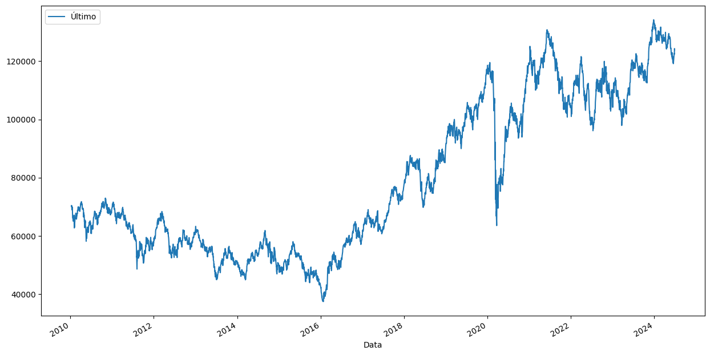
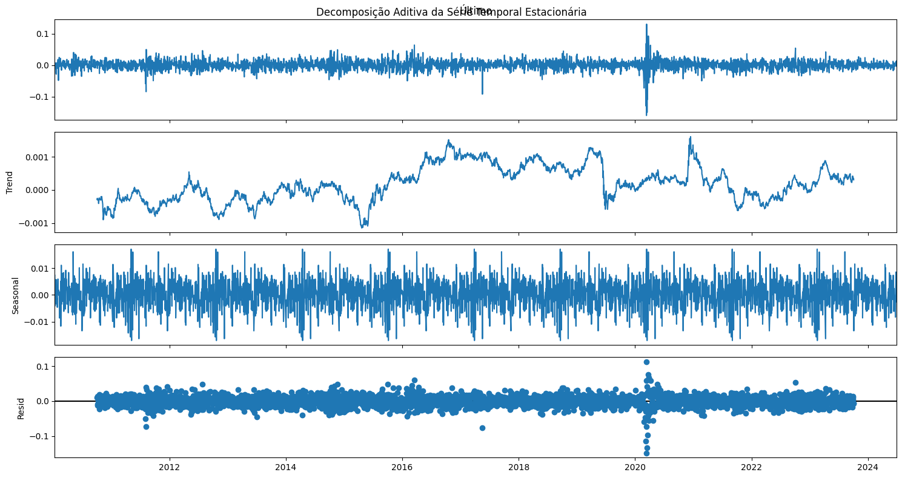

# Previsão do Fechamento da Bolsa de Valores IBOVESPA: Uma Análise Comparativa entre Modelos para predição de séries temporais


### Colaboradores
@bmuller70/[Bruno Müller](https://www.linkedin.com/in/bruno-muller-335630196/) :computer:		

@marialuisamartins/[Maria Luisa Martins Brasil](https://www.linkedin.com/in/marialuisamartinsb/) :computer:	

@--/[Maria Luiza Martins](https://www.linkedin.com/in/maria-luiza-martins-4115b213b/) :computer:	

@Pahmxx/[Phaola Oliveira Silva](https://www.linkedin.com/in/phaola-oliveira/) :computer:	


## Introdução
O Índice Bovespa (IBOVESPA) é o principal indicador do desempenho médio das cotações das ações negociadas na Bolsa de Valores de São Paulo (B3). Desde sua criação, em 1968, o índice tem sido uma referência crucial para investidores, analistas e economistas no acompanhamento do mercado acionário brasileiro. O IBOVESPA reflete a performance das empresas mais significativas e com maior volume de negociação na bolsa, proporcionando uma visão abrangente da saúde financeira do setor corporativo no Brasil. Esses índices não interessam apenas aos investidores, mas é também através deles que podemos observar saúde das empresas, expectativas de crescimento econômico e outras características econômicos do momento atual do país.

A previsão do fechamento do IBOVESPA é uma tarefa complexa e que possui relevância, tanto para investidores que buscam maximizar seus retornos quanto para gestores de risco que precisam mitigar potenciais perdas. Diversos métodos de predição de séries temporais têm sido aplicados na tentativa de antecipar os movimentos do índice, cada um com suas particularidades e níveis de precisão. 

Este trabalho visa realizar uma análise comparativa entre diferentes modelos de predição, destacando suas vantagens, limitações e a eficácia na previsão do fechamento da B3. Vamos abordar desde a captura dos dados e o desenvolvimento das etapas de tratamento até modelagem e avaliação de desempenho dos modelos escolhidos. 

## Tratamento da base de dados
- **Captura de dados**\
   Os dados foram extraídos do site da [Investing](https://br.investing.com/indices/bovespa-historical-data), abrangendo o período de 2010 até 2024. A base de dados contém 3585 registros, cada um representando uma entrada diária com 7 colunas de informações sobre o IBOVESPA. O DataFrame resultante tem a seguinte estrutura:
 ```
<class 'pandas.core.frame.DataFrame'>
RangeIndex: 3585 entries, 0 to 3584
Data columns (total 7 columns):
#   Column    Non-Null Count  Dtype 
0   Data      3585 non-null   int64 
1   Último    3585 non-null   int64 
2   Abertura  3585 non-null   int64 
3   Máxima    3585 non-null   int64 
4   Mínima    3585 non-null   int64 
5   Vol.      3584 non-null   object
6   Var%      3585 non-null   object
dtypes: int64(5), object(2)
```

**Exemplo de uma linha de dados:**
```
Data       Último   Abertura   Máxima   Mínima   Vol.    Var%
28062024   123907   124308     124500   123298   9,07B   -0,32%
```

- **Verificação de dados:**
  - Identificação e tratamento de zeros e valores nulos foram realizados. A coluna "Vol." apresentou um valor nulo, que foi tratado para manter a integridade dos dados.
    
  - A coluna 'Data' foi ajustada para garantir que todas as datas estivessem no formato de 8 dígitos e convertida para o tipo de dado datetime. Isso facilita a análise temporal dos dados.
    
  - Foram criadas novas colunas para o dia, mês e ano com base na coluna 'Data', o que permite análises temporais mais detalhadas.
    
  - O índice do DataFrame foi ajustado para representar a data, facilitando a análise das séries temporais.
```
dados = pd.read_csv('/content/drive/My Drive/Fase 2/Dados Históricos - Ibovespa.csv', encoding='utf-8', sep=',', thousands='.', decimal=',')

### Arrumar a Data para que tenha 8 digitos em todas tipo 10032024 e 04032024
dados['Data'] = dados['Data'].astype(str).str.zfill(8)

# Coloca em Formato de Data
dados['Data'] = pd.to_datetime(dados['Data'], format='%d%m%Y', errors='coerce')

# Cria coluna de Mês e Ano
dados['Data'] = dados['ref'] = dados ['Data']
dados['mes'] = dados['Data'].dt.month
dados['ano'] = dados['Data'].dt.year
dados['dia'] = dados['Data'].dt.day
dados = dados.set_index('Data')
```
## Análise da Série Temporal
 - **Visualização da serie**


 - **Decomposição Sazonal:** Uso de um ciclo sazonal de 30 dias (+- 1 mês) para decompor a série em três componentes: tendência, sazonalidade e resíduo.

   
 - **Teste de Dickey-Fuller (ADF):** Avaliação da estacionariedade da série temporal.
    - Estatística ADF e Valores Críticos: Verificação da estacionariedade com base na estatística ADF e valores críticos.
    - p-value: Interpretação do valor-p para determinar a estacionariedade da série.
      
     Para fazer essa avaliação usamos a função da bibliteca do [statsmodel](https://www.statsmodels.org/dev/generated/statsmodels.tsa.stattools.adfuller.html) adfuller e criamos um pequena função para interpretar os resultados, de forma que pudessemos utilizar
     em outro momento caso fosse necessário.

```
#Teste de Dickey Fuller --- Pra vermos se a série é estacionária ou não.
from statsmodels.tsa.stattools import adfuller

result = adfuller(dados['Último'])

print('ADF Statistic:', result[0])
print('p-value:', result[1])
print('Critical Values:')
for key, value in result[4].items():
    print(f'\t{key}: {value}')

# Interpretar o resultado do teste
alpha = 0.05
if result[1] < alpha:
    msg = 'Série é estacionária (rejeita H0)'
else:
    msg = 'Série não é estacionária (falha em rejeitar H0)'

print('\nResultado do teste de estacionariedade após 1ª diferenciação:')
print(msg)

-----------------------------------------------------------------------------------------------------

ADF Statistic: -0.845409062221046
p-value: 0.8054183906334276
Critical Values:
	1%: -3.4321794657443268
	5%: -2.8623483552705715
	10%: -2.5672003006136257

Resultado do teste de estacionariedade após 1ª diferenciação:
Série não é estacionária (falha em rejeitar H0)
```

Podemos observar que o resultado da nossa função é corrobora com a hipótese nula, de que a série não é [estacionária](https://people.duke.edu/~rnau/411diff.htm). Dessa forma passamos ao processo de diferenciação para sua transformação. 
      
 - **Diferenciação:** Aplicação de diferenciação simples e sazonal para tornar a série estacionária.
```
# Visualizando os dados originais
print("Dados de Fecho do Ibovespa:\n", dados2.head())

# Aplicar log nos dados para estabilizar a variância
train_log = np.log(dados2)

# Diferenciação simples
train_diff = train_log.diff().dropna()

# Visualizando os dados diferenciados
print("\nDados Diferenciados (Primeira Diferença):\n", train_diff.head())

# Diferenciação sazonal (anual para dados diários)
train_seasonal_diff = train_log.diff(365).dropna()

# Visualizando os dados sazonalmente diferenciados
print("\nDados Sazonalmente Diferenciados (Anual):\n", train_seasonal_diff.head())

# Função para imprimir o resultado do teste ADF
def teste_adf(serie):
    resultado = adfuller(serie)
    print(f'Estatística ADF: {resultado[0]}')
    print(f'Valor-p: {resultado[1]}')
    print(f'Valores Críticos:')
    for chave, valor in resultado[4].items():
        print(f'   {chave}: {valor}')

# Teste ADF na série diferenciada
print("\nTeste ADF para série diferenciada:")
teste_adf(train_diff)

# Teste ADF na série sazonalmente diferenciada
print("\nTeste ADF para série sazonalmente diferenciada:")
teste_adf(train_seasonal_diff)

---------------------------------------------------------------

Dados de Fecho do Ibovespa:
             Último
Data              
2010-01-11   70433
2010-01-12   70076
2010-01-13   70385
2010-01-14   69801
2010-01-15   68978

Dados Diferenciados (Primeira Diferença):
               Último
Data                
2010-01-12 -0.005082
2010-01-13  0.004400
2010-01-14 -0.008332
2010-01-15 -0.011861
2010-01-18  0.006114

Dados Sazonalmente Diferenciados (Anual):
               Último
Data                
2011-07-01 -0.105293
2011-07-04 -0.092402
2011-07-05 -0.110227
2011-07-06 -0.109442
2011-07-07 -0.103320

Teste ADF para série diferenciada:
Estatística ADF: -22.23585251419555
Valor-p: 0.0
Valores Críticos:
   1%: -3.4321794657443268
   5%: -2.8623483552705715
   10%: -2.5672003006136257

Teste ADF para série sazonalmente diferenciada:
Estatística ADF: -3.2226342329227267
Valor-p: 0.01871133927444365
Valores Críticos:
   1%: -3.4323875260668344
   5%: -2.862440255934873
   10%: -2.5672492261933377
```


Vamos visualizar novamente a serie após a diferenciação


A partir da diferenciação vamos plotar a analise de decomposição da serie.




## Modelagem da Série Temporal

 - **Modelo ARIMA**
	- Seleção do Modelo: Identificação dos parâmetros (p, d, q) e sazonalidade (P, D, Q, S).
	- Parâmetros do Modelo:
		 - AR(1) (ar.L1): Coeficiente de 0.9881 (significativo).
		 - MA(1) (ma.L1): Coeficiente de -0.0096 (não significativo).
		 - AR Sazonal(30) (ar.S.L30): Coeficiente de -0.5351 (significativo).
	- Critérios de Informação: AIC, BIC e HQIC.
	- Testes Diagnósticos: Ljung-Box, Jarque-Bera e Heteroskedasticity.
	- Diagnóstico do Modelo: Análise dos resíduos para verificar padrões e adequação do modelo,

## Avaliação do Modelo ARIMA

 - **Métricas de Avaliação:**
	- MSE (Mean Squared Error): 799,849.81
	- MAE (Mean Absolute Error): 708.31
	- MAPE (Mean Absolute Percentage Error): 7.49%
		- O MAPE relativamente baixo indica um bom desempenho geral do ARIMA. Embora o MSE e o MAE sejam altos, o MAPE fornece uma visão mais relativa e confiável da eficácia do modelo.

- **Modelo XGBoost**
	- Parâmetros do Modelo: {'learning_rate': 0.2, 'max_depth': 7, 'n_estimators': 150}.
	- Treinamento e Previsão: Ajuste do modelo aos dados de treino e avaliação nas previsões.
	- Análise de Overfitting: Comparação de métricas de treinamento e teste para identificar sinais de overfitting.

## Resultados e Discussão
 - **Modelo ARIMA:** Embora tenha mostrado um MAPE razoável (7.49%), o ARIMA apresentou valores altos de MAE (708.31) e MSE (799,849.81). A análise dos resíduos sugere que o modelo está ajustado de forma adequada, sem sinais claros de overfitting. O MAPE é um bom indicador da precisão relativa do modelo.
   
 - **Modelo XGBoost:** Mostrou um excelente desempenho com MAE (3.95) e MSE (53.53) baixos, mas evidências de overfitting foram observadas, especialmente pela discrepância entre o desempenho em treinamento e teste. O MAPE extremamente baixo (0.04%) sugere que o modelo pode ter se ajustado demais aos dados de treinamento.

### Análise dos Resíduos:
 - **ARIMA:** Os resíduos mostraram uma distribuição razoavelmente normal, mas o histograma não era perfeitamente normal, indicando possíveis discrepâncias.

 - **XGBoost:** Os resíduos estavam próximos de zero, indicando uma boa correspondência entre previsões e valores reais, mas a precisão elevada pode mascarar problemas de overfitting.

### Impacto das Métricas:
 - **ARIMA:** Embora os valores altos de MSE e MAE sejam indicativos de erros grandes, o MAPE fornece uma visão relativa mais confiável, considerando a escala dos dados.

 - **XGBoost:** A baixa performance em dados de teste indica que o modelo pode estar se ajustando demais, o que é preocupante para as previsões futuras.

## Conclusão

 - **Resumo dos Resultados:** O ARIMA, apesar de ter apresentado métricas de erro mais altas, mostrou-se mais robusto e menos sujeito a overfitting em comparação ao XGBoost. O MAPE mais baixo do ARIMA é indicativo de uma previsibilidade mais consistente.

 - **Justificativa das Técnicas Utilizadas:** A escolha do ARIMA foi fundamentada na sua capacidade de generalização e estabilidade em previsões, mesmo com erros absolutos mais elevados. O XGBoost, apesar de seu bom desempenho absoluto, foi menos confiável devido ao overfitting.

 - **Recomendações para Trabalhos Futuros:** Melhorar o modelo XGBoost para evitar overfitting e explorar técnicas adicionais para validação cruzada e ajuste de parâmetros. Considerar a inclusão de variáveis exógenas ou modelos híbridos para aprimorar a precisão das previsões.
